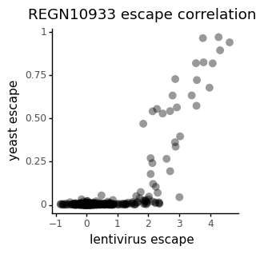

```python
import itertools
import math
import os
import re
import warnings

from IPython.display import display, HTML

import matplotlib
import matplotlib as mpl
import matplotlib.pyplot as plt
import natsort

import numpy as np
import pandas as pd
from plotnine import *
import seaborn

import neutcurve
from neutcurve.colorschemes import CBMARKERS, CBPALETTE

import yaml
```


```python
warnings.simplefilter('ignore')
```


```python
with open('config.yaml') as f:
    config = yaml.safe_load(f)
```


```python
theme_set(theme_seaborn(style='white', context='talk', font_scale=1))
plt.style.use('seaborn-white')
```


```python
resultsdir=config['resultsdir']
os.makedirs(resultsdir, exist_ok=True)
```


```python
#read data
lenti_DMS = pd.read_csv(config['lenti_dms_REGN10933'])
yeast_DMS_Star = pd.read_csv(config['yeast_dms_REGN10933_Star'])
```


```python
a = ['214a' , '214b', '214c']
lenti_DMS = lenti_DMS[~lenti_DMS['site'].isin(a)]

lenti_DMS['site']=lenti_DMS['site'].astype(int)
lenti_DMS
```


<div>
<style scoped>
    .dataframe tbody tr th:only-of-type {
        vertical-align: middle;
    }

    .dataframe tbody tr th {
        vertical-align: top;
    }

    .dataframe thead th {
        text-align: right;
    }
</style>
<table border="1" class="dataframe">
  <thead>
    <tr style="text-align: right;">
      <th></th>
      <th>epitope</th>
      <th>site</th>
      <th>wildtype</th>
      <th>mutant</th>
      <th>mutation</th>
      <th>escape_mean</th>
      <th>escape_median</th>
      <th>escape_std</th>
      <th>n_models</th>
      <th>times_seen</th>
      <th>frac_models</th>
    </tr>
  </thead>
  <tbody>
    <tr>
      <th>0</th>
      <td>1</td>
      <td>1</td>
      <td>M</td>
      <td>F</td>
      <td>M1F</td>
      <td>0.1881</td>
      <td>0.1881</td>
      <td>0.0822</td>
      <td>2</td>
      <td>2.50</td>
      <td>0.50</td>
    </tr>
    <tr>
      <th>1</th>
      <td>1</td>
      <td>1</td>
      <td>M</td>
      <td>I</td>
      <td>M1I</td>
      <td>-0.0159</td>
      <td>-0.0159</td>
      <td>0.0653</td>
      <td>2</td>
      <td>3.00</td>
      <td>0.50</td>
    </tr>
    <tr>
      <th>2</th>
      <td>1</td>
      <td>1</td>
      <td>M</td>
      <td>K</td>
      <td>M1K</td>
      <td>1.6372</td>
      <td>1.4280</td>
      <td>0.9661</td>
      <td>3</td>
      <td>1.00</td>
      <td>0.75</td>
    </tr>
    <tr>
      <th>3</th>
      <td>1</td>
      <td>1</td>
      <td>M</td>
      <td>L</td>
      <td>M1L</td>
      <td>0.0128</td>
      <td>0.0167</td>
      <td>0.0803</td>
      <td>4</td>
      <td>1.50</td>
      <td>1.00</td>
    </tr>
    <tr>
      <th>4</th>
      <td>1</td>
      <td>1</td>
      <td>M</td>
      <td>N</td>
      <td>M1N</td>
      <td>0.1310</td>
      <td>0.0393</td>
      <td>0.2769</td>
      <td>3</td>
      <td>1.00</td>
      <td>0.75</td>
    </tr>
    <tr>
      <th>...</th>
      <td>...</td>
      <td>...</td>
      <td>...</td>
      <td>...</td>
      <td>...</td>
      <td>...</td>
      <td>...</td>
      <td>...</td>
      <td>...</td>
      <td>...</td>
      <td>...</td>
    </tr>
    <tr>
      <th>8222</th>
      <td>1</td>
      <td>1253</td>
      <td>*</td>
      <td>G</td>
      <td>*1253G</td>
      <td>0.0076</td>
      <td>0.0076</td>
      <td>0.1399</td>
      <td>2</td>
      <td>1.00</td>
      <td>0.50</td>
    </tr>
    <tr>
      <th>8223</th>
      <td>1</td>
      <td>1253</td>
      <td>*</td>
      <td>L</td>
      <td>*1253L</td>
      <td>-0.2359</td>
      <td>-0.2359</td>
      <td>0.1647</td>
      <td>2</td>
      <td>5.00</td>
      <td>0.50</td>
    </tr>
    <tr>
      <th>8224</th>
      <td>1</td>
      <td>1253</td>
      <td>*</td>
      <td>R</td>
      <td>*1253R</td>
      <td>0.0062</td>
      <td>0.0033</td>
      <td>0.0827</td>
      <td>4</td>
      <td>17.75</td>
      <td>1.00</td>
    </tr>
    <tr>
      <th>8225</th>
      <td>1</td>
      <td>1253</td>
      <td>*</td>
      <td>W</td>
      <td>*1253W</td>
      <td>-0.1891</td>
      <td>-0.1784</td>
      <td>0.2414</td>
      <td>4</td>
      <td>1.00</td>
      <td>1.00</td>
    </tr>
    <tr>
      <th>8226</th>
      <td>1</td>
      <td>1253</td>
      <td>*</td>
      <td>-</td>
      <td>*1253-</td>
      <td>0.8441</td>
      <td>0.8441</td>
      <td>1.2023</td>
      <td>2</td>
      <td>1.00</td>
      <td>0.50</td>
    </tr>
  </tbody>
</table>
<p>8227 rows × 11 columns</p>
</div>


```python
yeast_DMS_Star
```


<div>
<style scoped>
    .dataframe tbody tr th:only-of-type {
        vertical-align: middle;
    }

    .dataframe tbody tr th {
        vertical-align: top;
    }

    .dataframe thead th {
        text-align: right;
    }
</style>
<table border="1" class="dataframe">
  <thead>
    <tr style="text-align: right;">
      <th></th>
      <th>condition</th>
      <th>site</th>
      <th>wildtype</th>
      <th>mutation</th>
      <th>mut_escape</th>
      <th>site_total_escape</th>
      <th>site_max_escape</th>
    </tr>
  </thead>
  <tbody>
    <tr>
      <th>0</th>
      <td>REGN10933</td>
      <td>331</td>
      <td>N</td>
      <td>A</td>
      <td>0.003320</td>
      <td>0.02906</td>
      <td>0.00380</td>
    </tr>
    <tr>
      <th>1</th>
      <td>REGN10933</td>
      <td>331</td>
      <td>N</td>
      <td>D</td>
      <td>0.002249</td>
      <td>0.02906</td>
      <td>0.00380</td>
    </tr>
    <tr>
      <th>2</th>
      <td>REGN10933</td>
      <td>331</td>
      <td>N</td>
      <td>E</td>
      <td>0.001125</td>
      <td>0.02906</td>
      <td>0.00380</td>
    </tr>
    <tr>
      <th>3</th>
      <td>REGN10933</td>
      <td>331</td>
      <td>N</td>
      <td>F</td>
      <td>0.001125</td>
      <td>0.02906</td>
      <td>0.00380</td>
    </tr>
    <tr>
      <th>4</th>
      <td>REGN10933</td>
      <td>331</td>
      <td>N</td>
      <td>G</td>
      <td>0.001125</td>
      <td>0.02906</td>
      <td>0.00380</td>
    </tr>
    <tr>
      <th>...</th>
      <td>...</td>
      <td>...</td>
      <td>...</td>
      <td>...</td>
      <td>...</td>
      <td>...</td>
      <td>...</td>
    </tr>
    <tr>
      <th>7787</th>
      <td>REGN10933</td>
      <td>531</td>
      <td>T</td>
      <td>R</td>
      <td>NaN</td>
      <td>0.06410</td>
      <td>0.01125</td>
    </tr>
    <tr>
      <th>7788</th>
      <td>REGN10933</td>
      <td>531</td>
      <td>T</td>
      <td>S</td>
      <td>NaN</td>
      <td>0.06410</td>
      <td>0.01125</td>
    </tr>
    <tr>
      <th>7789</th>
      <td>REGN10933</td>
      <td>531</td>
      <td>T</td>
      <td>V</td>
      <td>NaN</td>
      <td>0.06410</td>
      <td>0.01125</td>
    </tr>
    <tr>
      <th>7790</th>
      <td>REGN10933</td>
      <td>531</td>
      <td>T</td>
      <td>W</td>
      <td>NaN</td>
      <td>0.06410</td>
      <td>0.01125</td>
    </tr>
    <tr>
      <th>7791</th>
      <td>REGN10933</td>
      <td>531</td>
      <td>T</td>
      <td>Y</td>
      <td>NaN</td>
      <td>0.06410</td>
      <td>0.01125</td>
    </tr>
  </tbody>
</table>
<p>7792 rows × 7 columns</p>
</div>


## Compare to Star dataset


```python
merged_DMS = pd.merge(yeast_DMS_Star, lenti_DMS,  how='inner',
                      left_on=['site', 'mutation'],
                      right_on = ['site', 'mutant'])
merged_DMS
```


<div>
<style scoped>
    .dataframe tbody tr th:only-of-type {
        vertical-align: middle;
    }

    .dataframe tbody tr th {
        vertical-align: top;
    }

    .dataframe thead th {
        text-align: right;
    }
</style>
<table border="1" class="dataframe">
  <thead>
    <tr style="text-align: right;">
      <th></th>
      <th>condition</th>
      <th>site</th>
      <th>wildtype_x</th>
      <th>mutation_x</th>
      <th>mut_escape</th>
      <th>site_total_escape</th>
      <th>site_max_escape</th>
      <th>epitope</th>
      <th>wildtype_y</th>
      <th>mutant</th>
      <th>mutation_y</th>
      <th>escape_mean</th>
      <th>escape_median</th>
      <th>escape_std</th>
      <th>n_models</th>
      <th>times_seen</th>
      <th>frac_models</th>
    </tr>
  </thead>
  <tbody>
    <tr>
      <th>0</th>
      <td>REGN10933</td>
      <td>331</td>
      <td>N</td>
      <td>D</td>
      <td>0.002249</td>
      <td>0.02906</td>
      <td>0.00380</td>
      <td>1</td>
      <td>N</td>
      <td>D</td>
      <td>N331D</td>
      <td>0.2651</td>
      <td>0.2202</td>
      <td>0.1995</td>
      <td>4</td>
      <td>5.00</td>
      <td>1.0</td>
    </tr>
    <tr>
      <th>1</th>
      <td>REGN10933</td>
      <td>331</td>
      <td>N</td>
      <td>D</td>
      <td>NaN</td>
      <td>0.02906</td>
      <td>0.00380</td>
      <td>1</td>
      <td>N</td>
      <td>D</td>
      <td>N331D</td>
      <td>0.2651</td>
      <td>0.2202</td>
      <td>0.1995</td>
      <td>4</td>
      <td>5.00</td>
      <td>1.0</td>
    </tr>
    <tr>
      <th>2</th>
      <td>REGN10933</td>
      <td>331</td>
      <td>N</td>
      <td>D</td>
      <td>NaN</td>
      <td>0.02906</td>
      <td>0.00380</td>
      <td>1</td>
      <td>N</td>
      <td>D</td>
      <td>N331D</td>
      <td>0.2651</td>
      <td>0.2202</td>
      <td>0.1995</td>
      <td>4</td>
      <td>5.00</td>
      <td>1.0</td>
    </tr>
    <tr>
      <th>3</th>
      <td>REGN10933</td>
      <td>331</td>
      <td>N</td>
      <td>D</td>
      <td>NaN</td>
      <td>0.02906</td>
      <td>0.00380</td>
      <td>1</td>
      <td>N</td>
      <td>D</td>
      <td>N331D</td>
      <td>0.2651</td>
      <td>0.2202</td>
      <td>0.1995</td>
      <td>4</td>
      <td>5.00</td>
      <td>1.0</td>
    </tr>
    <tr>
      <th>4</th>
      <td>REGN10933</td>
      <td>331</td>
      <td>N</td>
      <td>K</td>
      <td>0.001125</td>
      <td>0.02906</td>
      <td>0.00380</td>
      <td>1</td>
      <td>N</td>
      <td>K</td>
      <td>N331K</td>
      <td>-0.0255</td>
      <td>-0.0313</td>
      <td>0.0417</td>
      <td>4</td>
      <td>1.25</td>
      <td>1.0</td>
    </tr>
    <tr>
      <th>...</th>
      <td>...</td>
      <td>...</td>
      <td>...</td>
      <td>...</td>
      <td>...</td>
      <td>...</td>
      <td>...</td>
      <td>...</td>
      <td>...</td>
      <td>...</td>
      <td>...</td>
      <td>...</td>
      <td>...</td>
      <td>...</td>
      <td>...</td>
      <td>...</td>
      <td>...</td>
    </tr>
    <tr>
      <th>3119</th>
      <td>REGN10933</td>
      <td>531</td>
      <td>T</td>
      <td>N</td>
      <td>NaN</td>
      <td>0.06410</td>
      <td>0.01125</td>
      <td>1</td>
      <td>T</td>
      <td>N</td>
      <td>T531N</td>
      <td>-0.3022</td>
      <td>-0.2341</td>
      <td>0.4065</td>
      <td>4</td>
      <td>2.25</td>
      <td>1.0</td>
    </tr>
    <tr>
      <th>3120</th>
      <td>REGN10933</td>
      <td>531</td>
      <td>T</td>
      <td>S</td>
      <td>0.011250</td>
      <td>0.06410</td>
      <td>0.01125</td>
      <td>1</td>
      <td>T</td>
      <td>S</td>
      <td>T531S</td>
      <td>-0.1862</td>
      <td>-0.0157</td>
      <td>0.3807</td>
      <td>4</td>
      <td>1.75</td>
      <td>1.0</td>
    </tr>
    <tr>
      <th>3121</th>
      <td>REGN10933</td>
      <td>531</td>
      <td>T</td>
      <td>S</td>
      <td>NaN</td>
      <td>0.06410</td>
      <td>0.01125</td>
      <td>1</td>
      <td>T</td>
      <td>S</td>
      <td>T531S</td>
      <td>-0.1862</td>
      <td>-0.0157</td>
      <td>0.3807</td>
      <td>4</td>
      <td>1.75</td>
      <td>1.0</td>
    </tr>
    <tr>
      <th>3122</th>
      <td>REGN10933</td>
      <td>531</td>
      <td>T</td>
      <td>S</td>
      <td>NaN</td>
      <td>0.06410</td>
      <td>0.01125</td>
      <td>1</td>
      <td>T</td>
      <td>S</td>
      <td>T531S</td>
      <td>-0.1862</td>
      <td>-0.0157</td>
      <td>0.3807</td>
      <td>4</td>
      <td>1.75</td>
      <td>1.0</td>
    </tr>
    <tr>
      <th>3123</th>
      <td>REGN10933</td>
      <td>531</td>
      <td>T</td>
      <td>S</td>
      <td>NaN</td>
      <td>0.06410</td>
      <td>0.01125</td>
      <td>1</td>
      <td>T</td>
      <td>S</td>
      <td>T531S</td>
      <td>-0.1862</td>
      <td>-0.0157</td>
      <td>0.3807</td>
      <td>4</td>
      <td>1.75</td>
      <td>1.0</td>
    </tr>
  </tbody>
</table>
<p>3124 rows × 17 columns</p>
</div>


```python
merged_DMS = merged_DMS[['site', 'mutation_y', 'mut_escape' , 'escape_mean', 'escape_median', 'n_models', 'times_seen', 'frac_models','wildtype_y', 'mutation_x']]

merged_DMS
```


<div>
<style scoped>
    .dataframe tbody tr th:only-of-type {
        vertical-align: middle;
    }

    .dataframe tbody tr th {
        vertical-align: top;
    }

    .dataframe thead th {
        text-align: right;
    }
</style>
<table border="1" class="dataframe">
  <thead>
    <tr style="text-align: right;">
      <th></th>
      <th>site</th>
      <th>mutation_y</th>
      <th>mut_escape</th>
      <th>escape_mean</th>
      <th>escape_median</th>
      <th>n_models</th>
      <th>times_seen</th>
      <th>frac_models</th>
      <th>wildtype_y</th>
      <th>mutation_x</th>
    </tr>
  </thead>
  <tbody>
    <tr>
      <th>0</th>
      <td>331</td>
      <td>N331D</td>
      <td>0.002249</td>
      <td>0.2651</td>
      <td>0.2202</td>
      <td>4</td>
      <td>5.00</td>
      <td>1.0</td>
      <td>N</td>
      <td>D</td>
    </tr>
    <tr>
      <th>1</th>
      <td>331</td>
      <td>N331D</td>
      <td>NaN</td>
      <td>0.2651</td>
      <td>0.2202</td>
      <td>4</td>
      <td>5.00</td>
      <td>1.0</td>
      <td>N</td>
      <td>D</td>
    </tr>
    <tr>
      <th>2</th>
      <td>331</td>
      <td>N331D</td>
      <td>NaN</td>
      <td>0.2651</td>
      <td>0.2202</td>
      <td>4</td>
      <td>5.00</td>
      <td>1.0</td>
      <td>N</td>
      <td>D</td>
    </tr>
    <tr>
      <th>3</th>
      <td>331</td>
      <td>N331D</td>
      <td>NaN</td>
      <td>0.2651</td>
      <td>0.2202</td>
      <td>4</td>
      <td>5.00</td>
      <td>1.0</td>
      <td>N</td>
      <td>D</td>
    </tr>
    <tr>
      <th>4</th>
      <td>331</td>
      <td>N331K</td>
      <td>0.001125</td>
      <td>-0.0255</td>
      <td>-0.0313</td>
      <td>4</td>
      <td>1.25</td>
      <td>1.0</td>
      <td>N</td>
      <td>K</td>
    </tr>
    <tr>
      <th>...</th>
      <td>...</td>
      <td>...</td>
      <td>...</td>
      <td>...</td>
      <td>...</td>
      <td>...</td>
      <td>...</td>
      <td>...</td>
      <td>...</td>
      <td>...</td>
    </tr>
    <tr>
      <th>3119</th>
      <td>531</td>
      <td>T531N</td>
      <td>NaN</td>
      <td>-0.3022</td>
      <td>-0.2341</td>
      <td>4</td>
      <td>2.25</td>
      <td>1.0</td>
      <td>T</td>
      <td>N</td>
    </tr>
    <tr>
      <th>3120</th>
      <td>531</td>
      <td>T531S</td>
      <td>0.011250</td>
      <td>-0.1862</td>
      <td>-0.0157</td>
      <td>4</td>
      <td>1.75</td>
      <td>1.0</td>
      <td>T</td>
      <td>S</td>
    </tr>
    <tr>
      <th>3121</th>
      <td>531</td>
      <td>T531S</td>
      <td>NaN</td>
      <td>-0.1862</td>
      <td>-0.0157</td>
      <td>4</td>
      <td>1.75</td>
      <td>1.0</td>
      <td>T</td>
      <td>S</td>
    </tr>
    <tr>
      <th>3122</th>
      <td>531</td>
      <td>T531S</td>
      <td>NaN</td>
      <td>-0.1862</td>
      <td>-0.0157</td>
      <td>4</td>
      <td>1.75</td>
      <td>1.0</td>
      <td>T</td>
      <td>S</td>
    </tr>
    <tr>
      <th>3123</th>
      <td>531</td>
      <td>T531S</td>
      <td>NaN</td>
      <td>-0.1862</td>
      <td>-0.0157</td>
      <td>4</td>
      <td>1.75</td>
      <td>1.0</td>
      <td>T</td>
      <td>S</td>
    </tr>
  </tbody>
</table>
<p>3124 rows × 10 columns</p>
</div>


```python
merged_DMS = merged_DMS[merged_DMS['mut_escape'].notna()]
merged_DMS   
# merged_DMS.to_csv('merged.csv', sep='\t')
```


<div>
<style scoped>
    .dataframe tbody tr th:only-of-type {
        vertical-align: middle;
    }

    .dataframe tbody tr th {
        vertical-align: top;
    }

    .dataframe thead th {
        text-align: right;
    }
</style>
<table border="1" class="dataframe">
  <thead>
    <tr style="text-align: right;">
      <th></th>
      <th>site</th>
      <th>mutation_y</th>
      <th>mut_escape</th>
      <th>escape_mean</th>
      <th>escape_median</th>
      <th>n_models</th>
      <th>times_seen</th>
      <th>frac_models</th>
      <th>wildtype_y</th>
      <th>mutation_x</th>
    </tr>
  </thead>
  <tbody>
    <tr>
      <th>0</th>
      <td>331</td>
      <td>N331D</td>
      <td>0.002249</td>
      <td>0.2651</td>
      <td>0.2202</td>
      <td>4</td>
      <td>5.00</td>
      <td>1.00</td>
      <td>N</td>
      <td>D</td>
    </tr>
    <tr>
      <th>4</th>
      <td>331</td>
      <td>N331K</td>
      <td>0.001125</td>
      <td>-0.0255</td>
      <td>-0.0313</td>
      <td>4</td>
      <td>1.25</td>
      <td>1.00</td>
      <td>N</td>
      <td>K</td>
    </tr>
    <tr>
      <th>8</th>
      <td>331</td>
      <td>N331S</td>
      <td>0.001125</td>
      <td>0.0492</td>
      <td>0.0204</td>
      <td>4</td>
      <td>7.50</td>
      <td>1.00</td>
      <td>N</td>
      <td>S</td>
    </tr>
    <tr>
      <th>12</th>
      <td>331</td>
      <td>N331T</td>
      <td>0.001857</td>
      <td>0.0444</td>
      <td>-0.0843</td>
      <td>4</td>
      <td>1.50</td>
      <td>1.00</td>
      <td>N</td>
      <td>T</td>
    </tr>
    <tr>
      <th>16</th>
      <td>332</td>
      <td>I332S</td>
      <td>0.001130</td>
      <td>-0.1613</td>
      <td>-0.1613</td>
      <td>2</td>
      <td>1.00</td>
      <td>0.50</td>
      <td>I</td>
      <td>S</td>
    </tr>
    <tr>
      <th>...</th>
      <td>...</td>
      <td>...</td>
      <td>...</td>
      <td>...</td>
      <td>...</td>
      <td>...</td>
      <td>...</td>
      <td>...</td>
      <td>...</td>
      <td>...</td>
    </tr>
    <tr>
      <th>3104</th>
      <td>530</td>
      <td>S530R</td>
      <td>0.001125</td>
      <td>-0.0048</td>
      <td>-0.0048</td>
      <td>2</td>
      <td>1.50</td>
      <td>0.50</td>
      <td>S</td>
      <td>R</td>
    </tr>
    <tr>
      <th>3108</th>
      <td>530</td>
      <td>S530T</td>
      <td>0.006129</td>
      <td>0.0573</td>
      <td>-0.0533</td>
      <td>4</td>
      <td>3.25</td>
      <td>1.00</td>
      <td>S</td>
      <td>T</td>
    </tr>
    <tr>
      <th>3112</th>
      <td>531</td>
      <td>T531I</td>
      <td>0.004738</td>
      <td>-0.6515</td>
      <td>-0.6515</td>
      <td>1</td>
      <td>1.00</td>
      <td>0.25</td>
      <td>T</td>
      <td>I</td>
    </tr>
    <tr>
      <th>3116</th>
      <td>531</td>
      <td>T531N</td>
      <td>0.003722</td>
      <td>-0.3022</td>
      <td>-0.2341</td>
      <td>4</td>
      <td>2.25</td>
      <td>1.00</td>
      <td>T</td>
      <td>N</td>
    </tr>
    <tr>
      <th>3120</th>
      <td>531</td>
      <td>T531S</td>
      <td>0.011250</td>
      <td>-0.1862</td>
      <td>-0.0157</td>
      <td>4</td>
      <td>1.75</td>
      <td>1.00</td>
      <td>T</td>
      <td>S</td>
    </tr>
  </tbody>
</table>
<p>781 rows × 10 columns</p>
</div>


```python
escape_corr=(
    ggplot(merged_DMS.loc[(merged_DMS['frac_models'] >=0.25)&( merged_DMS['times_seen'] >=3)&(merged_DMS['n_models'] >=3)]) +
    aes(x="escape_median", y="mut_escape") +
    geom_point(size=4, alpha=0.4, stroke = 0) + 
    theme_classic() +
    theme(figure_size=(3,3)) +
    labs(
        title = "REGN10933 escape correlation",
        x="lentivirus escape",
        y="yeast escape")
)

_ = escape_corr.draw()

_.savefig(f'{resultsdir}/REGN10933_escape_corr_Star.pdf', bbox_inches='tight')

```


    

    


```python

```
