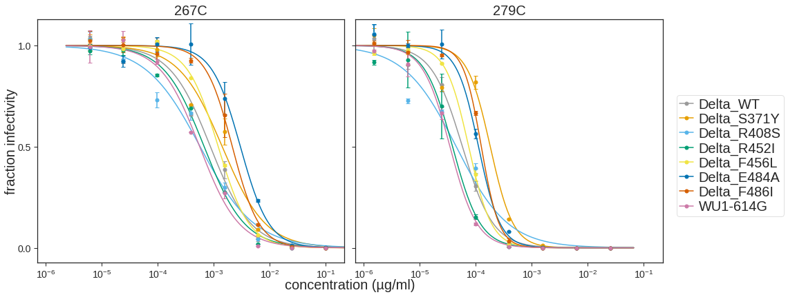
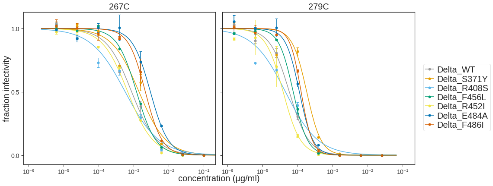

# Analysis of SARS-COV-2 Delta variant virus neutalization by Delta breakthrough sera

### Set up Analysis


```python
import itertools
import math
import os
import re
import warnings

from IPython.display import display, HTML

import matplotlib
import matplotlib as mpl
import matplotlib.pyplot as plt
import natsort

import numpy as np
import pandas as pd
from plotnine import *
import seaborn

import neutcurve
from neutcurve.colorschemes import CBMARKERS, CBPALETTE

import yaml
```


```python
warnings.simplefilter('ignore')
```

Read config file.


```python
with open('config.yaml') as f:
    config = yaml.safe_load(f)
```

Set seaborn theme:


```python
theme_set(theme_seaborn(style='white', context='talk', font_scale=1))
plt.style.use('seaborn-white')
```


```python
resultsdir=config['resultsdir']
os.makedirs(resultsdir, exist_ok=True)
```

## Read in data


```python
frac_infect = pd.read_csv(config['mAb_neuts_Delta'], index_col=0)
```

## Fit Hill curve to data using [`neutcurve`](https://jbloomlab.github.io/neutcurve/)


```python
fits = neutcurve.CurveFits(frac_infect, fixtop= True)
```


```python
fitparams = (
        fits.fitParams()
        # get columns of interest
        [['serum', 'ic50', 'ic50_bound','virus']]
        .assign(NT50=lambda x: 1/x['ic50'])        
        )
```


```python
fitparams['ic50_is_bound'] = fitparams['ic50_bound'].apply(lambda x: True if x!='interpolated' else False)
```


```python
fitparams
```


<div>
<style scoped>
    .dataframe tbody tr th:only-of-type {
        vertical-align: middle;
    }

    .dataframe tbody tr th {
        vertical-align: top;
    }

    .dataframe thead th {
        text-align: right;
    }
</style>
<table border="1" class="dataframe">
  <thead>
    <tr style="text-align: right;">
      <th></th>
      <th>serum</th>
      <th>ic50</th>
      <th>ic50_bound</th>
      <th>virus</th>
      <th>NT50</th>
      <th>ic50_is_bound</th>
    </tr>
  </thead>
  <tbody>
    <tr>
      <th>0</th>
      <td>267C</td>
      <td>0.000877</td>
      <td>interpolated</td>
      <td>Delta_WT</td>
      <td>1140.075443</td>
      <td>False</td>
    </tr>
    <tr>
      <th>1</th>
      <td>267C</td>
      <td>0.001423</td>
      <td>interpolated</td>
      <td>Delta_S371Y</td>
      <td>702.519527</td>
      <td>False</td>
    </tr>
    <tr>
      <th>2</th>
      <td>267C</td>
      <td>0.000574</td>
      <td>interpolated</td>
      <td>Delta_R408S</td>
      <td>1742.442902</td>
      <td>False</td>
    </tr>
    <tr>
      <th>3</th>
      <td>267C</td>
      <td>0.000678</td>
      <td>interpolated</td>
      <td>Delta_R452I</td>
      <td>1475.567093</td>
      <td>False</td>
    </tr>
    <tr>
      <th>4</th>
      <td>267C</td>
      <td>0.001209</td>
      <td>interpolated</td>
      <td>Delta_F456L</td>
      <td>827.313268</td>
      <td>False</td>
    </tr>
    <tr>
      <th>5</th>
      <td>267C</td>
      <td>0.003011</td>
      <td>interpolated</td>
      <td>Delta_E484A</td>
      <td>332.114214</td>
      <td>False</td>
    </tr>
    <tr>
      <th>6</th>
      <td>267C</td>
      <td>0.002161</td>
      <td>interpolated</td>
      <td>Delta_F486I</td>
      <td>462.792977</td>
      <td>False</td>
    </tr>
    <tr>
      <th>7</th>
      <td>267C</td>
      <td>0.000564</td>
      <td>interpolated</td>
      <td>WU1-614G</td>
      <td>1774.380328</td>
      <td>False</td>
    </tr>
    <tr>
      <th>8</th>
      <td>279C</td>
      <td>0.000057</td>
      <td>interpolated</td>
      <td>Delta_WT</td>
      <td>17396.620811</td>
      <td>False</td>
    </tr>
    <tr>
      <th>9</th>
      <td>279C</td>
      <td>0.000181</td>
      <td>interpolated</td>
      <td>Delta_S371Y</td>
      <td>5534.384262</td>
      <td>False</td>
    </tr>
    <tr>
      <th>10</th>
      <td>279C</td>
      <td>0.000045</td>
      <td>interpolated</td>
      <td>Delta_R408S</td>
      <td>22416.711949</td>
      <td>False</td>
    </tr>
    <tr>
      <th>11</th>
      <td>279C</td>
      <td>0.000038</td>
      <td>interpolated</td>
      <td>Delta_R452I</td>
      <td>26097.865620</td>
      <td>False</td>
    </tr>
    <tr>
      <th>12</th>
      <td>279C</td>
      <td>0.000074</td>
      <td>interpolated</td>
      <td>Delta_F456L</td>
      <td>13442.645652</td>
      <td>False</td>
    </tr>
    <tr>
      <th>13</th>
      <td>279C</td>
      <td>0.000112</td>
      <td>interpolated</td>
      <td>Delta_E484A</td>
      <td>8966.074139</td>
      <td>False</td>
    </tr>
    <tr>
      <th>14</th>
      <td>279C</td>
      <td>0.000125</td>
      <td>interpolated</td>
      <td>Delta_F486I</td>
      <td>7989.773972</td>
      <td>False</td>
    </tr>
    <tr>
      <th>15</th>
      <td>279C</td>
      <td>0.000034</td>
      <td>interpolated</td>
      <td>WU1-614G</td>
      <td>29029.302139</td>
      <td>False</td>
    </tr>
  </tbody>
</table>
</div>


## Plot neut curves for mAbs


```python
fig, axes = fits.plotSera(xlabel='concentration (µg/ml)',
                          ncol=3,
                          widthscale=2,
                          heightscale=2,
                          titlesize=20, labelsize=20, ticksize=14,
                          legendfontsize=20, yticklocs=[0,0.5,1],
                          markersize=5, linewidth=1.5,
                          max_viruses_per_subplot = 8,
                          markers=['o','o','o','o','o','o','o','o']
                         )
plotfile = 'Sera_neuts.pdf'
print(f"Saving to {plotfile}")
fig.savefig(f'{resultsdir}/{plotfile}', bbox_inches='tight')
```

    Saving to Sera_neuts.pdf


    

    


```python
fig, axes = fits.plotSera(xlabel='concentration (µg/ml)',
                          ncol=3,
                          viruses = ['Delta_WT', 'Delta_S371Y', 'Delta_R408S','Delta_F456L','Delta_R452I', 'Delta_E484A', 'Delta_F486I'],
                          widthscale=2,
                          heightscale=2,
                          titlesize=20, labelsize=20, ticksize=14,
                          legendfontsize=20, yticklocs=[0,0.5,1],
                          markersize=5, linewidth=1.5,
                          max_viruses_per_subplot = 8,
                          markers=['o','o','o','o','o','o','o','o']
                         )
plotfile = 'Delta_sera_only.pdf'
print(f"Saving to {plotfile}")
fig.savefig(f'{resultsdir}/{plotfile}', bbox_inches='tight')
```

    Saving to Delta_sera_only.pdf


    

    


```python

```
