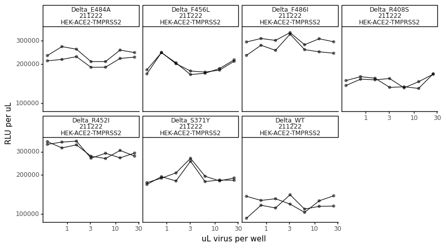

# Calculate titers of spike-pseudotyped lentiviruses used for Delta serum selections


```python
import os
import warnings

import math
import numpy as np 

from IPython.display import display, HTML
import matplotlib.pyplot as plt

from neutcurve.colorschemes import CBMARKERS, CBPALETTE
from mizani.formatters import scientific_format

import pandas as pd
from plotnine import *

import yaml
```


```python
warnings.simplefilter('ignore')
```

Read config


```python
with open('config.yaml') as f:
    config = yaml.safe_load(f)
```

Make output directory if needed


```python
resultsdir=config['resultsdir']
os.makedirs(resultsdir, exist_ok=True)
```


```python
titers = pd.read_csv(config['virus_titers_Delta_serum'])

titers = (titers
          .assign(RLUperuL=lambda x: x['RLU_per_well'] / x['uL_virus'],
                  date=lambda x: x['date'].astype(str)
                 )
         )

display(HTML(titers.head().to_html(index=False)))
```


<table border="1" class="dataframe">
  <thead>
    <tr style="text-align: right;">
      <th>replicate</th>
      <th>virus</th>
      <th>dilution</th>
      <th>uL_virus</th>
      <th>RLU_per_well</th>
      <th>date</th>
      <th>cells</th>
      <th>for_testing</th>
      <th>RLUperuL</th>
    </tr>
  </thead>
  <tbody>
    <tr>
      <td>rep1</td>
      <td>Delta_WT</td>
      <td>0.025000</td>
      <td>25.0000</td>
      <td>2884431</td>
      <td>211222</td>
      <td>HEK-ACE2-TMPRSS2</td>
      <td>serum_validation</td>
      <td>115377.24</td>
    </tr>
    <tr>
      <td>rep1</td>
      <td>Delta_WT</td>
      <td>0.012500</td>
      <td>12.5000</td>
      <td>1435815</td>
      <td>211222</td>
      <td>HEK-ACE2-TMPRSS2</td>
      <td>serum_validation</td>
      <td>114865.20</td>
    </tr>
    <tr>
      <td>rep1</td>
      <td>Delta_WT</td>
      <td>0.006250</td>
      <td>6.2500</td>
      <td>683772</td>
      <td>211222</td>
      <td>HEK-ACE2-TMPRSS2</td>
      <td>serum_validation</td>
      <td>109403.52</td>
    </tr>
    <tr>
      <td>rep1</td>
      <td>Delta_WT</td>
      <td>0.003125</td>
      <td>3.1250</td>
      <td>440012</td>
      <td>211222</td>
      <td>HEK-ACE2-TMPRSS2</td>
      <td>serum_validation</td>
      <td>140803.84</td>
    </tr>
    <tr>
      <td>rep1</td>
      <td>Delta_WT</td>
      <td>0.001563</td>
      <td>1.5625</td>
      <td>174388</td>
      <td>211222</td>
      <td>HEK-ACE2-TMPRSS2</td>
      <td>serum_validation</td>
      <td>111608.32</td>
    </tr>
  </tbody>
</table>


```python
ncol=min(8, titers['virus'].nunique())
nrow=math.ceil(titers['virus'].nunique() / ncol)

p = (ggplot(titers.dropna()
            ) +
     aes('uL_virus', 'RLU_per_well', group='replicate') +
     geom_point(size=1.5) +
     geom_line() +
     facet_wrap('~virus+date', ncol=4) +
     scale_y_log10(name='RLU per well') +
     scale_x_log10(name='uL virus per well') +
     theme_classic() +
     theme(axis_text_x=element_text(),
           figure_size=(10,5),
           )
     )

_ = p.draw()
```


    

    


```python
p = (ggplot(titers.dropna()
            ) +
     aes('uL_virus', 'RLUperuL', group='replicate') +
     geom_point(size=1.5, alpha=0.5) +
     geom_line() +
     facet_wrap('~virus+date+cells', ncol=4) +
     scale_y_log10(name='RLU per uL') +
     scale_x_log10(name='uL virus per well') +
     theme_classic() +
     theme(axis_text_x=element_text(),
           figure_size=(10,5),
           ) 
     )

_ = p.draw()
```


    

    


Check that above plots are approximately linear 


```python
average_titers = (titers
                  .dropna() # missing values for some replicates
#                   .query('uL_virus > 1') # drop concentrations that would not be linear
                  .groupby(['virus', 'date'])
                  .agg(mean_RLUperuL=pd.NamedAgg(column='RLUperuL', aggfunc=np.mean))
                  .reset_index()
                 )

display(HTML(average_titers.head().to_html(index=False)))
```


<table border="1" class="dataframe">
  <thead>
    <tr style="text-align: right;">
      <th>virus</th>
      <th>date</th>
      <th>mean_RLUperuL</th>
    </tr>
  </thead>
  <tbody>
    <tr>
      <td>Delta_E484A</td>
      <td>211222</td>
      <td>225492.000000</td>
    </tr>
    <tr>
      <td>Delta_F456L</td>
      <td>211222</td>
      <td>194003.837143</td>
    </tr>
    <tr>
      <td>Delta_F486I</td>
      <td>211222</td>
      <td>285200.237143</td>
    </tr>
    <tr>
      <td>Delta_R408S</td>
      <td>211222</td>
      <td>147827.542857</td>
    </tr>
    <tr>
      <td>Delta_R452I</td>
      <td>211222</td>
      <td>309206.885714</td>
    </tr>
  </tbody>
</table>


```python
p = (ggplot(average_titers, 
            aes(x='virus', y='mean_RLUperuL', color='date')
           ) +
     geom_point(size=2.5, alpha=0.5)+
     theme_classic() +
     theme(axis_text_x=element_text(angle=90, vjust=1, hjust=0.5),
           figure_size=(average_titers['virus'].nunique()*.6,3),
           axis_title_x=element_blank()
          ) +
     scale_y_continuous(labels=scientific_format(digits=2))+
     ylab('RLU\nper µL')+
     labs(title='pseudovirus titers') +
     scale_color_manual(values=CBPALETTE)
    )

_ = p.draw()
```


    

    


Calculate how much virus to use in neut assays:


```python
target_RLU = 5e5
uL_virus_per_well = 50

dilute_virus = (average_titers
                .groupby(['virus', 'date'])
                .agg(RLUperuL=pd.NamedAgg(column='mean_RLUperuL', aggfunc=np.mean))
                .reset_index()
                .assign(target_RLU = target_RLU,
                        uL_virus_per_well = uL_virus_per_well,
                        dilution_factor = lambda x: x['RLUperuL']/target_RLU*uL_virus_per_well,
                        uL_per_4mL = lambda x: 4000/x['dilution_factor'],
                        media_for_4ml = lambda x: 4000 - 4000/x['dilution_factor']
                       )
               )


titerfile = os.path.join(resultsdir, 'virus_titers_Delta_serum.csv')
print(f"Saving to {titerfile}")

dilute_virus.to_csv(titerfile, index=False)

display(HTML(dilute_virus.to_html(index=False)))
```

    Saving to results/virus_titers_Delta_serum.csv


<table border="1" class="dataframe">
  <thead>
    <tr style="text-align: right;">
      <th>virus</th>
      <th>date</th>
      <th>RLUperuL</th>
      <th>target_RLU</th>
      <th>uL_virus_per_well</th>
      <th>dilution_factor</th>
      <th>uL_per_4mL</th>
      <th>media_for_4ml</th>
    </tr>
  </thead>
  <tbody>
    <tr>
      <td>Delta_E484A</td>
      <td>211222</td>
      <td>225492.000000</td>
      <td>500000.0</td>
      <td>50</td>
      <td>22.549200</td>
      <td>177.389885</td>
      <td>3822.610115</td>
    </tr>
    <tr>
      <td>Delta_F456L</td>
      <td>211222</td>
      <td>194003.837143</td>
      <td>500000.0</td>
      <td>50</td>
      <td>19.400384</td>
      <td>206.181489</td>
      <td>3793.818511</td>
    </tr>
    <tr>
      <td>Delta_F486I</td>
      <td>211222</td>
      <td>285200.237143</td>
      <td>500000.0</td>
      <td>50</td>
      <td>28.520024</td>
      <td>140.252338</td>
      <td>3859.747662</td>
    </tr>
    <tr>
      <td>Delta_R408S</td>
      <td>211222</td>
      <td>147827.542857</td>
      <td>500000.0</td>
      <td>50</td>
      <td>14.782754</td>
      <td>270.585570</td>
      <td>3729.414430</td>
    </tr>
    <tr>
      <td>Delta_R452I</td>
      <td>211222</td>
      <td>309206.885714</td>
      <td>500000.0</td>
      <td>50</td>
      <td>30.920689</td>
      <td>129.363225</td>
      <td>3870.636775</td>
    </tr>
    <tr>
      <td>Delta_S371Y</td>
      <td>211222</td>
      <td>195583.502857</td>
      <td>500000.0</td>
      <td>50</td>
      <td>19.558350</td>
      <td>204.516227</td>
      <td>3795.483773</td>
    </tr>
    <tr>
      <td>Delta_WT</td>
      <td>211222</td>
      <td>120391.077143</td>
      <td>500000.0</td>
      <td>50</td>
      <td>12.039108</td>
      <td>332.250537</td>
      <td>3667.749463</td>
    </tr>
  </tbody>
</table>


```python

```
